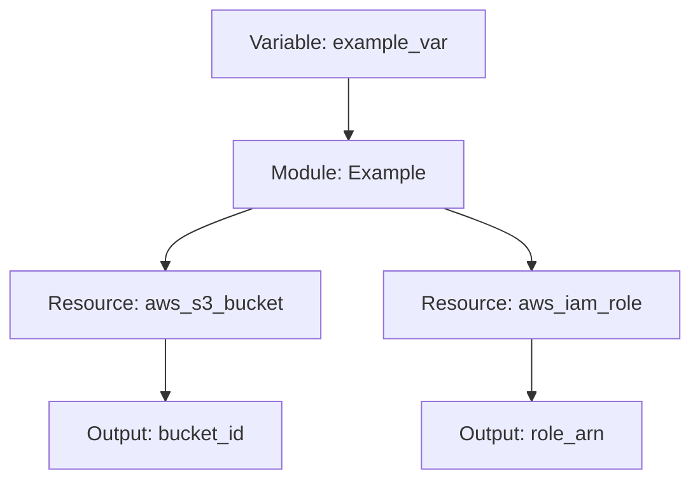

# Terraform Module Template

This repository serves as a template for creating new Terraform modules. It provides a standardized structure and includes common files and configurations to help you get started quickly.

## Structure

```
terraform-module-template/
├── .github/                # GitHub specific files
│   └── workflows/          # GitHub Actions workflows
├── examples/               # Example implementations of the module
│   └── basic/              # Basic example
├── modules/                # Internal sub-modules (if needed)
├── tests/                  # Tests for the module
├── docs/                   # Documentation
│   └── diagrams/           # Auto-generated diagrams
├── .gitignore              # Git ignore file
├── .pre-commit-config.yaml # Pre-commit hooks configuration
├── .tflint.hcl             # TFLint configuration
├── LICENSE                 # License file
├── README.md               # This file
├── main.tf                 # Main module resources
├── variables.tf            # Input variables
├── outputs.tf              # Output variables
├── versions.tf             # Required Terraform and provider versions
└── locals.tf               # Local variables
```

## Usage

1. Copy this template to create a new module repository
2. Update the README.md with specific module documentation
3. Implement your Terraform resources in main.tf
4. Define input variables in variables.tf
5. Define output variables in outputs.tf
6. Specify required versions in versions.tf
7. Create examples in the examples directory

## Examples

See the [examples](./examples) directory for working examples of how to use this module.

## Module Diagram

<!-- BEGIN_TF_DIAGRAMS -->
# Example Terraform Module Diagram

This is an example diagram that will be automatically replaced by the actual module diagram when the GitHub Action runs.


<!-- END_TF_DIAGRAMS -->

## Development

### Prerequisites

- [Terraform](https://www.terraform.io/downloads.html) >= 1.0.0
- [Go](https://golang.org/doc/install) >= 1.19 (for tests)
- [TFLint](https://github.com/terraform-linters/tflint) (for linting)
- [pre-commit](https://pre-commit.com/) (for git hooks)

### Local Development vs CI/CD

This repository uses two complementary approaches for development and quality assurance:

1. **Local Development Tools (Makefile)** - For developers to use during active development
2. **GitHub Actions Workflows** - For automated CI/CD processes on pull requests and merges

#### Using the Makefile (Local Development)

The Makefile provides convenient commands for local development tasks:

```bash
# View available commands
make help

# Format, validate, and lint code (common development tasks)
make dev

# Run all checks before submitting a PR
make pre-pr

# Individual tasks
make fmt        # Format Terraform code
make validate   # Validate Terraform code
make lint       # Run TFLint
make test       # Run tests
make docs       # Generate documentation locally
make diagrams   # Generate diagrams locally
```

#### GitHub Actions (CI/CD)

GitHub Actions workflows automatically run on pull requests and merges to main:

1. **Linting** - Checks code formatting, validates Terraform code, and runs TFLint
2. **Testing** - Runs Terratest tests and validates example configurations
3. **Documentation** - Automatically updates module documentation
4. **Diagrams** - Generates and updates diagrams of the module architecture

These workflows ensure consistent quality standards and keep documentation up-to-date.

### Linting

This module uses TFLint for linting Terraform code. To run the linter locally:

```bash
# Install TFLint
brew install tflint

# Initialize TFLint
tflint --init

# Run TFLint
tflint --recursive
```

### Testing

This module uses Terratest for testing. To run the tests locally:

```bash
cd tests
go test -v ./...
```

### Pre-commit Hooks

This module uses pre-commit hooks to ensure code quality. To install pre-commit hooks:

```bash
# Install pre-commit
pip install pre-commit

# Install the hooks
pre-commit install
```

### Diagram Generation

This module uses terraform-visual to generate diagrams from Terraform code. To generate diagrams locally:

```bash
# Install terraform-visual
npm install -g terraform-visual

# Run the diagram generation script
bash docs/scripts/generate_diagrams.sh
```

## CI/CD

This module includes GitHub Actions workflows for:

1. **Linting** - Checks code formatting, validates Terraform code, and runs TFLint
2. **Testing** - Runs Terratest tests and validates example configurations
3. **Documentation** - Automatically updates module documentation
4. **Diagrams** - Generates and updates diagrams of the module architecture

The workflows are automatically triggered on push to the main branch and on pull requests.

## Requirements

| Name | Version |
|------|---------|
| terraform | >= 1.0.0 |

## Inputs

| Name | Description | Type | Default | Required |
|------|-------------|------|---------|:--------:|
| example_var | Example input variable | `string` | `null` | no |

## Outputs

| Name | Description |
|------|-------------|
| example_output | Example output value |

## License

See [LICENSE](./LICENSE) for full details.
