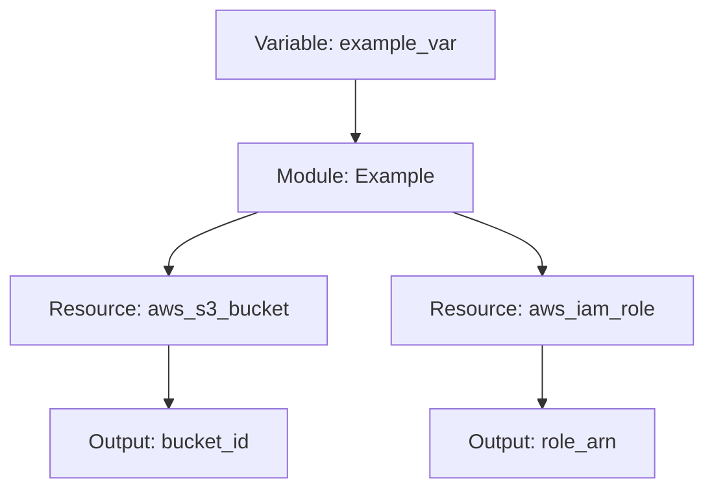

# Terraform Module Diagrams

This module includes automatic diagram generation to help visualize the infrastructure resources and their relationships.

## How It Works

1. The diagrams are generated using [terraform-visual](https://github.com/hieven/terraform-visual), which converts Terraform code into Mermaid diagrams.
2. A GitHub Actions workflow automatically generates and updates these diagrams whenever Terraform files change.
3. The diagrams are embedded directly in the README.md and stored in the `docs/diagrams/` directory.

## Local Development vs CI/CD

This repository uses two approaches for diagram generation:

### Local Development (Makefile)

For local development and previewing diagrams during active development:

```bash
# Generate diagrams locally
make diagrams
```

This command will:
1. Check if terraform-visual is installed
2. Generate diagrams for the main module and examples
3. Store them in the `docs/diagrams/` directory

Use this approach when:
- You're actively developing the module
- You want to preview diagram changes before committing
- You're working offline

### CI/CD (GitHub Actions)

For automated diagram generation and documentation updates:

The GitHub Actions workflow `.github/workflows/terraform-diagrams.yml` automatically:
1. Runs when Terraform files change in the main branch
2. Generates diagrams for the module and examples
3. Updates the README.md with the latest diagrams
4. Commits the changes back to the repository

This approach ensures that diagrams always stay in sync with the code without manual intervention.

## Types of Diagrams

1. **Module Diagram** - Shows the resources, inputs, and outputs of the main module
2. **Example Diagrams** - Shows the resources, inputs, and outputs for each example
3. **Architecture Diagram** - A high-level overview of the module's architecture
4. **Usage Flow** - A sequence diagram showing how to use the module

## Customizing Diagrams

You can customize the diagram generation by modifying:

1. `.terraform-visual.hcl` - Configuration for terraform-visual
2. `docs/scripts/generate_diagrams.sh` - The script that generates the diagrams
3. `.github/workflows/terraform-diagrams.yml` - The GitHub Actions workflow

## Viewing Diagrams

The diagrams are in Mermaid format, which is supported by GitHub and many other Markdown viewers. You can view them:

1. Directly in the README.md on GitHub
2. In the individual Markdown files in the `docs/diagrams/` directory
3. Using the [Mermaid Live Editor](https://mermaid.live/) for editing

## Example Diagram


