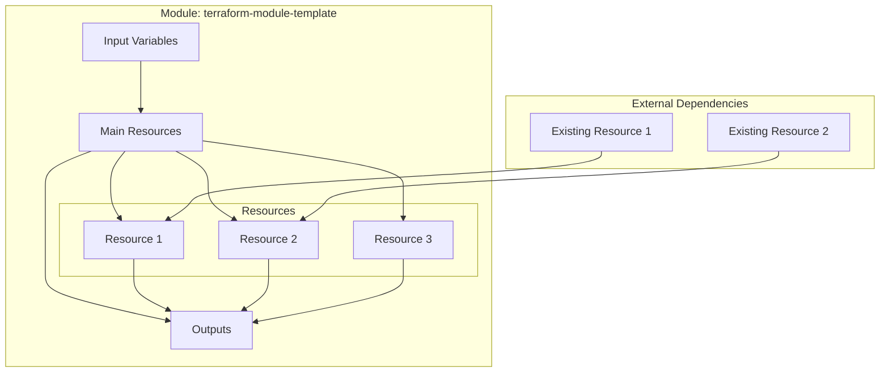
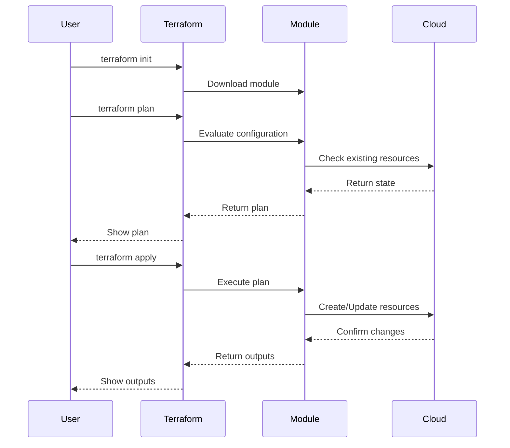

# Module Architecture Diagram

This diagram illustrates the high-level architecture of resources that might be created by this module.

```mermaid
graph TD
    subgraph "Module: terraform-module-template"
        A[Input Variables] --> B[Main Resources]
        B --> C[Outputs]
        
        subgraph "Resources"
            D[Resource 1]
            E[Resource 2]
            F[Resource 3]
        end
        
        B --> D
        B --> E
        B --> F
        
        D --> C
        E --> C
        F --> C
    end
    
    subgraph "External Dependencies"
        G[Existing Resource 1]
        H[Existing Resource 2]
    end
    
    G --> D
    H --> E
```

## Usage Flow

```mermaid
sequenceDiagram
    participant User
    participant Terraform
    participant Module
    participant Cloud
    
    User->>Terraform: terraform init
    Terraform->>Module: Download module
    User->>Terraform: terraform plan
    Terraform->>Module: Evaluate configuration
    Module->>Cloud: Check existing resources
    Cloud-->>Module: Return state
    Module-->>Terraform: Return plan
    Terraform-->>User: Show plan
    
    User->>Terraform: terraform apply
    Terraform->>Module: Execute plan
    Module->>Cloud: Create/Update resources
    Cloud-->>Module: Confirm changes
    Module-->>Terraform: Return outputs
    Terraform-->>User: Show outputs
```
