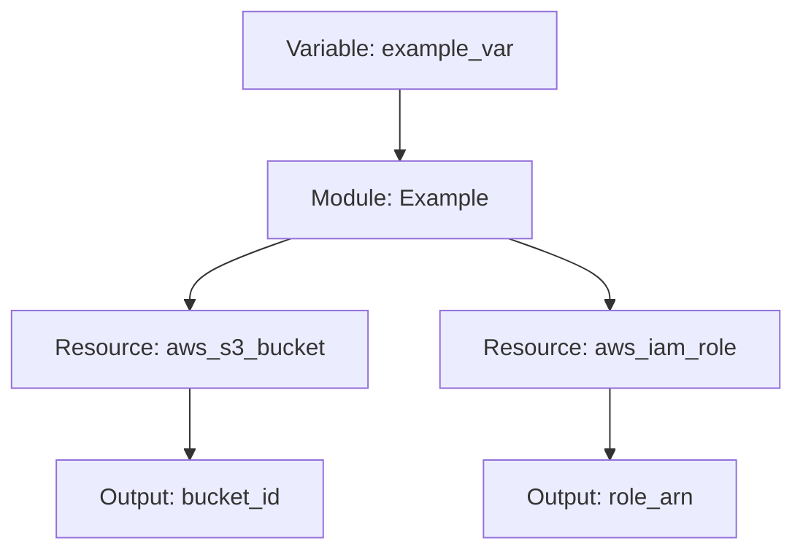

# Example Terraform Module Diagram

This is an example diagram that will be automatically replaced by the actual module diagram when the GitHub Action runs.

```mermaid
graph TD
    A[Module: Example] --> B[Resource: aws_s3_bucket]
    A --> C[Resource: aws_iam_role]
    B --> D[Output: bucket_id]
    C --> E[Output: role_arn]
    F[Variable: example_var] --> A
```
